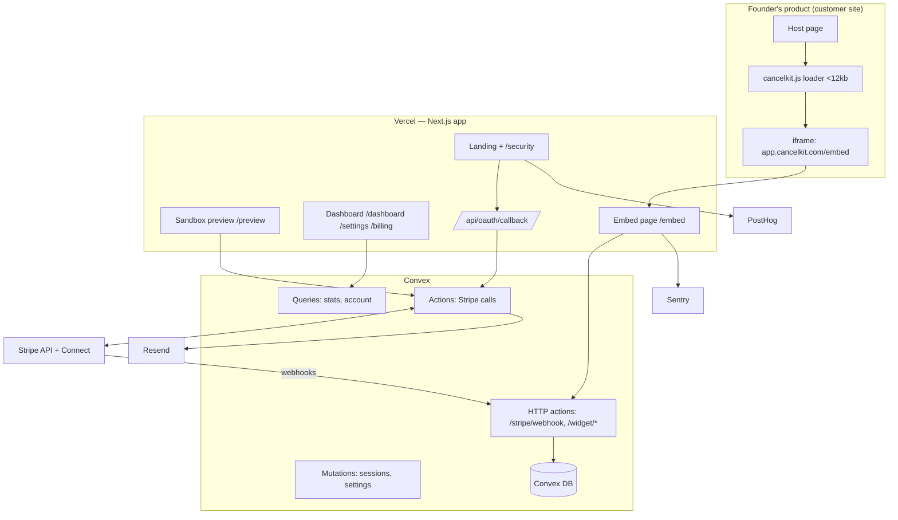

# PRD — CancelKit

## 1. Overview

### Product Summary

**CancelKit** — The easiest cancellation flow on Earth: a Stripe-connected widget that installs in under 5 minutes and turns "Cancel" clicks into pauses, discounts, and exit feedback.

CancelKit is two deployables: a Next.js web app (landing page, sandbox preview, founder dashboard, embed iframe) backed by Convex, and a <12kb vanilla-TypeScript widget loader that founders paste into their product as one script tag. The widget intercepts cancel clicks, collects an exit reason, and offers a subscription pause or coupon executed against the founder's live Stripe account via Stripe Connect.

### Objective

This PRD covers the MVP as defined in `docs/product-vision.md` § Product Strategy → MVP Definition: Stripe Connect OAuth onboarding, branded sandbox preview, the embeddable widget with exactly two deflection actions (pause + coupon), idempotent webhook handling, session-event logging, a single stats page, save emails, and CancelKit's own Stripe Billing. Everything in § Explicitly Out of Scope is out of scope here too (see § 13).

### Market Differentiation

The technical implementation must deliver three numbers: **10 seconds** from OAuth completion to a working branded preview, **5 minutes** from landing page to live widget, and **<12kb** gzipped widget loader. These are not aspirations — they are acceptance criteria (see § 7). The preview must render from live Stripe data with zero configuration, and the widget must be impossible to blame for breaking a host page. Enterprise competitors require integration projects; CancelKit's differentiation collapses if any step requires one.

### Magic Moment

OAuth completes → 10 seconds later the founder sees their own logo, coupons, and plans inside a working cancellation flow, before installing anything. Technically this requires: the OAuth callback immediately triggers a Convex action that fetches products, prices, coupons, and account branding in parallel; the preview page renders from that data with smart defaults (30-day pause pre-selected, best existing percent-off coupon pre-selected); no configuration screen exists between OAuth and preview. The fetch-and-render path is instrumented in PostHog; p95 over 10 seconds is a launch blocker.

### Success Criteria

- OAuth callback → preview rendered: p95 < 10s (PostHog-measured)
- Landing page → live widget: < 5 minutes for a founder following the install page
- Widget loader bundle: < 12kb gzipped; host page load impact < 50ms
- Zero billing-state errors: every Stripe mutation verified by read-back; replayed/out-of-order webhooks produce no state corruption
- 100% of cancel sessions produce a logged session event (including abandons)
- Save email delivered < 60s after a save
- All P0 functional requirements implemented and manually verified

## 2. Technical Architecture

### Architecture Overview



### Chosen Stack

| Layer | Choice | Rationale |
|---|---|---|
| Frontend | Next.js (App Router) | Dashboard, landing, preview, OAuth callback, and embed page in one deployable; best coding-agent support. Widget loader is a separate vanilla-TS bundle — no framework in the iframe host page. |
| Backend | Convex | TypeScript end-to-end, zero boilerplate, real-time reactivity for the live stats page; Stripe webhooks land on a Convex HTTP action. |
| Database | Convex Database | Included with backend; ACID transactions; webhook idempotency via indexed `stripeEventId` lookup; the `cancelSessions` table is the data moat from day one. |
| Auth | Stripe Connect as identity | The onboarding OAuth IS the sign-in — zero extra signup step, protecting the 10-second magic moment. Session = signed HTTP-only cookie (JWT via `jose`) keyed to the connected account. |
| Payments | Stripe Billing (platform account) | Already deep in Stripe; CancelKit dogfoods its own widget on its own cancel flow. |
| Analytics | PostHog | Free tier; the sandbox → OAuth → install → paid funnel is the core validation instrument. |
| Email | Resend | "You just saved a customer" email and monthly receipt are core delight mechanics. React Email for templates. |
| Error tracking | Sentry | A buggy widget touching live billing is existential; separate DSNs for app, Convex, and widget. |

### Stack Integration Guide

**Setup order:**
1. `npx create-next-app@latest` (TypeScript, App Router, Tailwind, `src/` dir)
2. `npm install convex` → `npx convex dev` (creates `convex/` dir, dev deployment)
3. Stripe: create platform account; enable **Connect (OAuth / standard accounts)**; note `STRIPE_CLIENT_ID`; create webhook endpoints (one for platform events, one for Connect account events) pointing at the Convex HTTP action URL (`https://<deployment>.convex.site/stripe/webhook`)
4. `npm install stripe jose @react-email/components resend posthog-js @sentry/nextjs`
5. Widget workspace: separate `widget/` package built with esbuild or Vite lib mode (IIFE output, no dependencies)
6. Sentry wizard for Next.js; manual `Sentry.init` in Convex actions and in the widget loader (use the lightweight `@sentry/browser` only inside the *embed page*, not the loader — the loader stays dependency-free and reports errors via a beacon to an HTTP action)

**Key integration patterns:**
- **Stripe on Convex:** all Stripe SDK calls happen in Convex **actions** (never queries/mutations — they're deterministic and can't do I/O). Actions call mutations to persist results. Use `new Stripe(secretKey)` with `{ stripeAccount: account.stripeAccountId }` per-request option for connected-account calls (standard Connect: platform secret key + `Stripe-Account` header; no per-account access tokens to store).
- **Webhooks:** Convex `httpAction` at `convex/http.ts`. Verify signature with `stripe.webhooks.constructEventAsync` (Web Crypto — the async variant is required in Convex's runtime). Two endpoints or one endpoint with two signing secrets (platform + Connect); recommended: one route, try both secrets.
- **Next.js ↔ Convex:** `ConvexProviderWithAuth` is not needed (no third-party auth provider); use plain `ConvexProvider` + pass the session JWT to Convex functions as an argument-validated token, verified inside a shared `requireAccount(ctx, token)` helper. Server components use `fetchQuery`/`fetchAction` from `convex/nextjs`.
- **Widget ↔ backend:** the iframe (`/embed`) talks to Convex HTTP actions (`/widget/session`, `/widget/resolve`) with `fetch`; CORS restricted to the app origin (the iframe is same-origin with the app, so CORS is simple — the *host page* never calls the API directly).

**Common gotchas:**
- Convex HTTP actions run on `<deployment>.convex.site`, not `.convex.cloud` — webhook URLs and widget API URLs must use `.site`.
- Stripe webhook signature verification needs the **raw request body**; in `httpAction` use `await request.text()` before any JSON parsing.
- `pause_collection` does not pause the subscription object's status — status stays `active`; the invoice behavior changes. The stats logic must treat `pause_collection.behavior === "void"` as "paused", not read `status`.
- Coupons vs promotion codes: apply coupons to subscriptions via `stripe.subscriptions.update(id, { discounts: [{ coupon }] })`. Only offer coupons with `valid: true` and duration `repeating` or `forever` (a `once` coupon is a weak save offer — still allowed, flagged in UI).
- OAuth redirect URI must match exactly in the Stripe Connect settings, including `https://` and no trailing slash.
- Next.js middleware can't read Convex — session cookie verification happens in middleware with `jose` (JWT verify only), account existence checks happen in the page/layout.

**Environment variables:**

| Variable | Where | Purpose |
|---|---|---|
| `STRIPE_SECRET_KEY` | Convex | Platform secret key (all API calls) |
| `STRIPE_CLIENT_ID` | Next.js + Convex | Connect OAuth client id |
| `STRIPE_WEBHOOK_SECRET_PLATFORM` | Convex | Platform events signing secret |
| `STRIPE_WEBHOOK_SECRET_CONNECT` | Convex | Connect account events signing secret |
| `SESSION_JWT_SECRET` | Next.js + Convex | Signs/verifies dashboard session JWTs |
| `NEXT_PUBLIC_CONVEX_URL` | Next.js | Convex client |
| `CONVEX_SITE_URL` | Next.js | HTTP action base for widget API |
| `RESEND_API_KEY` | Convex | Transactional email |
| `NEXT_PUBLIC_POSTHOG_KEY` / `NEXT_PUBLIC_POSTHOG_HOST` | Next.js | Analytics |
| `SENTRY_DSN` / `NEXT_PUBLIC_SENTRY_DSN` / `SENTRY_DSN_WIDGET` | All | Error tracking (separate widget DSN) |
| `NEXT_PUBLIC_APP_URL` | Next.js + widget build | Canonical app origin for iframe src |

### Repository Structure

```
cancelkit/
├── src/
│   ├── app/
│   │   ├── page.tsx                 # Landing page
│   │   ├── security/page.tsx        # Security page (scoped permissions, mechanisms)
│   │   ├── preview/page.tsx         # Branded sandbox preview (post-OAuth)
│   │   ├── demo/[slug]/page.tsx     # Pre-OAuth mocked sandbox for outreach links
│   │   ├── dashboard/page.tsx       # Stats page (live via Convex)
│   │   ├── install/page.tsx         # Script tag + HMAC snippet + live detection
│   │   ├── settings/page.tsx        # Offer defaults, kill switch, HMAC secret
│   │   ├── billing/page.tsx         # CancelKit's own subscription (dogfoods widget)
│   │   ├── embed/page.tsx           # Widget UI, loaded inside the iframe
│   │   └── api/
│   │       ├── oauth/callback/route.ts   # Stripe Connect OAuth callback → session cookie
│   │       └── auth/logout/route.ts
│   ├── components/
│   │   ├── ui/                      # Design-system primitives (per docs/design.md)
│   │   └── features/                # CancelFlow, StatsCards, InstallSnippet, ...
│   ├── lib/
│   │   ├── session.ts               # JWT sign/verify (jose), cookie helpers
│   │   ├── posthog.ts
│   │   └── constants.ts             # Exit reasons list, pause lengths
│   └── middleware.ts                # Protects /dashboard /settings /install /billing /preview
├── convex/
│   ├── schema.ts
│   ├── http.ts                      # /stripe/webhook, /widget/session, /widget/resolve, /widget/error
│   ├── accounts.ts                  # queries/mutations
│   ├── cancelSessions.ts            # session event log + stats query
│   ├── stripe.ts                    # actions: OAuth exchange, preview fetch, pause, coupon, cancel
│   ├── billing.ts                   # CancelKit's own subscription state
│   ├── emails.ts                    # action: save email, monthly receipt (Resend)
│   └── crons.ts                     # monthly receipt cron
├── widget/
│   ├── src/loader.ts                # <12kb IIFE: find trigger, open iframe, postMessage bridge
│   ├── src/types.ts                 # postMessage protocol types (shared, copied into app)
│   └── build.mjs                    # esbuild config, budget check (fails build > 12kb gzip)
├── emails/                          # React Email templates (save, receipt)
├── public/
└── docs/                            # VISION.md, product-vision.md, prd.md, product-roadmap.md, design.md
```

### Infrastructure & Deployment

- **Next.js → Vercel.** Connect the repo; production branch `main`. The widget loader is built in CI (`widget/build.mjs`) and emitted to `public/v1/cancelkit.js` so it ships on Vercel's CDN with long-cache headers (`Cache-Control: public, max-age=3600, stale-while-revalidate=86400` — 1h, not immutable, so fixes roll out fast; version-bump the path for breaking changes).
- **Convex → Convex Cloud.** `npx convex deploy` in CI (Vercel build step with `CONVEX_DEPLOY_KEY`). Dev/prod deployments are separate; Stripe test mode points at dev, live mode at prod.
- **CI/CD:** GitHub → Vercel automatic. Add a widget-size check to the build (fail if `cancelkit.js` gzip > 12kb).
- **Domains:** `cancelkit.com` (marketing + app on one Next.js deployment for MVP; split later if needed).

### Security Considerations

This product's security posture is a sales asset. Implement, then document on `/security`:

- **OAuth (Stripe Connect standard):** state parameter = random nonce stored in a short-lived cookie, verified on callback (CSRF). No per-account tokens stored — platform key + `Stripe-Account` header. Handle `account.application.deauthorized` webhook: mark account revoked, kill widget instantly.
- **Dashboard sessions:** JWT (HS256 via `jose`), 7-day expiry, `httpOnly`, `Secure`, `SameSite=Lax` cookie. No passwords exist anywhere in the system.
- **Widget config integrity:** the script tag carries `data-account` (public account key) + `data-customer` (Stripe customer id) + `data-hmac` (hex HMAC-SHA256 of the customer id, keyed by the account's widget secret, computed on the founder's server). `/widget/session` verifies the HMAC before returning any offer or executing anything. Without a valid HMAC, the widget refuses to act on live subscriptions.
- **Iframe isolation:** widget UI lives in a cross-origin iframe (`app` origin) — host-page CSS/JS cannot touch it, it cannot touch the host page. postMessage messages validated with an explicit `origin` check and a typed protocol; no `*` targets.
- **Webhooks:** signature verification on every event; idempotency via unique `stripeEventId` insert-if-absent inside a single mutation (Convex transactions make check-and-insert atomic).
- **API hardening:** `/widget/*` HTTP actions rate-limited per account (token bucket in a Convex table; e.g. 60 req/min/account); all inputs validated with Convex validators (`v.*`); Stripe mutation endpoints double-check subscription belongs to the HMAC'd customer.
- **Kill switch:** per-account boolean; when set, `/widget/session` returns `{ disabled: true }` and the loader does nothing — founders revert to native cancel behavior instantly.
- **Sentry PII scrubbing:** enable `beforeSend` scrubbing on all three DSNs — strip emails, customer ids to hashes, and never attach request bodies from `/widget/*`. Error payloads must never leak tokens or subscriber personal data.
- **No dark patterns, enforced structurally:** the embed always renders "Cancel my subscription anyway" as a visible, enabled action at every step.

### Cost Estimate

Monthly, first 6 months, < 1,000 users:

| Service | Tier | Cost | Free-tier limit |
|---|---|---|---|
| Vercel | Hobby → Pro when commercial | $0 → $20 | Hobby OK for validation; Pro required for commercial use per ToS |
| Convex | Free | $0 | Generous free tier (functions, storage, bandwidth) — validation volume is far below limits |
| Stripe | Pay-per-use | 2.9% + 30¢ per charge | Connect standard accounts: no platform fee |
| Resend | Free | $0 | 3,000 emails/mo, 100/day — hundreds of save emails fit |
| PostHog | Free | $0 | 1M events/mo |
| Sentry | Free (dev) | $0 → $26 | Free error quota fine at first; Team tier if volume grows |
| Domain | — | ~$1 | cancelkit.com amortized |
| **Total** | | **~$1–50/mo** | |

## 3. Data Model

### Entity Definitions

```typescript
// convex/schema.ts
import { defineSchema, defineTable } from "convex/server";
import { v } from "convex/values";

export default defineSchema({
  // One row per connected founder account. Created at OAuth callback.
  accounts: defineTable({
    stripeAccountId: v.string(),        // acct_... (unique, indexed)
    businessName: v.string(),           // from Stripe account object
    logoUrl: v.optional(v.string()),    // Stripe branding file, resolved to URL
    brandColor: v.optional(v.string()), // hex from Stripe branding
    email: v.optional(v.string()),      // account email from Stripe
    publicKey: v.string(),              // ck_pub_... shown in script tag (unique, indexed)
    widgetSecret: v.string(),           // HMAC key for customer verification (rotatable)
    offerConfig: v.object({
      pauseDays: v.number(),            // default 30
      couponId: v.optional(v.string()), // founder's chosen Stripe coupon; default = best valid coupon
    }),
    widgetStatus: v.union(
      v.literal("not_installed"),       // no heartbeat seen yet
      v.literal("live"),                // heartbeat seen in last 24h
      v.literal("killed"),              // kill switch engaged by founder
      v.literal("revoked")              // Stripe access deauthorized
    ),
    lastHeartbeatAt: v.optional(v.number()),
    createdAt: v.number(),
  })
    .index("by_stripe_account", ["stripeAccountId"])
    .index("by_public_key", ["publicKey"]),

  // The data moat. One row per cancel-flow session, saved or not.
  cancelSessions: defineTable({
    accountId: v.id("accounts"),
    stripeCustomerId: v.string(),
    stripeSubscriptionId: v.string(),
    mrrCents: v.number(),               // subscription value at session start
    currency: v.string(),               // ISO code from the subscription
    planNickname: v.optional(v.string()),
    reason: v.optional(v.string()),     // enum string from REASONS list; set when chosen
    offerType: v.optional(v.union(v.literal("pause"), v.literal("coupon"))),
    offerDetail: v.optional(v.string()),// "pause_30d" | coupon id
    outcome: v.union(
      v.literal("open"),                // session started
      v.literal("saved_pause"),
      v.literal("saved_coupon"),
      v.literal("canceled"),
      v.literal("abandoned")            // closed without resolving; swept after 30 min
    ),
    sandbox: v.boolean(),               // true for preview sessions — excluded from stats
    createdAt: v.number(),
    resolvedAt: v.optional(v.number()),
  })
    .index("by_account", ["accountId", "createdAt"])
    .index("by_account_outcome", ["accountId", "outcome"])
    .index("by_open_sessions", ["outcome", "createdAt"]),  // for the abandon sweeper

  // Webhook idempotency ledger.
  webhookEvents: defineTable({
    stripeEventId: v.string(),          // evt_... (unique, indexed)
    type: v.string(),
    stripeAccountId: v.optional(v.string()), // set for Connect events
    processedAt: v.number(),
  }).index("by_event_id", ["stripeEventId"]),

  // CancelKit's own subscription (platform Stripe account).
  billing: defineTable({
    accountId: v.id("accounts"),
    stripeCustomerId: v.string(),       // cus_... on the PLATFORM account
    stripeSubscriptionId: v.optional(v.string()),
    status: v.union(
      v.literal("none"), v.literal("active"), v.literal("past_due"),
      v.literal("paused"), v.literal("canceled")
    ),
    priceId: v.string(),                // founder-rate price id
    updatedAt: v.number(),
  }).index("by_account", ["accountId"]),

  // Rate limiting for /widget/* (token bucket per account).
  rateLimits: defineTable({
    key: v.string(),                    // `${accountId}` or `${accountId}:${ip}`
    tokens: v.number(),
    updatedAt: v.number(),
  }).index("by_key", ["key"]),
});
```

Exit reasons are a fixed enum in `src/lib/constants.ts` (shared with the embed): `too_expensive`, `not_using`, `missing_features`, `switching_competitor`, `too_difficult`, `temporary_pause_needed`, `other` (with optional free text stored in `offerDetail`-adjacent `reasonText: v.optional(v.string())` — add that field to `cancelSessions`).

### Relationships

- `accounts 1—many cancelSessions` via `accountId` (Convex `v.id` reference). No cascade delete — sessions are the dataset; on account deletion, sessions are anonymized (strip `stripeCustomerId`), never removed.
- `accounts 1—1 billing` via `accountId`.
- `webhookEvents` and `rateLimits` are standalone ledgers.
- Stripe objects (customers, subscriptions, coupons) are **never mirrored** as full local tables — Stripe is the source of truth; only ids and point-in-time facts (mrrCents) are stored.

### Indexes

- `accounts.by_stripe_account` — webhook events arrive with `event.account`; every Connect event handler resolves the account by this index.
- `accounts.by_public_key` — every `/widget/session` call resolves the account from the script tag's public key.
- `cancelSessions.by_account` — stats page queries, newest-first.
- `cancelSessions.by_account_outcome` — save-rate aggregates without scanning.
- `cancelSessions.by_open_sessions` — the abandon-sweeper cron finds stale `open` sessions.
- `webhookEvents.by_event_id` — the idempotency check; the atomic check-and-insert runs on this index for every webhook.
- `billing.by_account`, `rateLimits.by_key` — direct lookups.

## 4. API Specification

### API Design Philosophy

Three API surfaces:

1. **Convex queries/mutations/actions** — used by the Next.js app (dashboard, preview, settings). Authenticated by passing the session JWT as a validated arg; a shared `requireAccount` helper verifies it and returns the account.
2. **Convex HTTP actions** — the widget API (`/widget/*`) and the Stripe webhook. The widget API is authenticated by account public key + per-customer HMAC, not by user session.
3. **Next.js route handlers** — only OAuth callback and logout (cookie manipulation must happen on the app origin).

Error format (HTTP actions): `{ error: string, code: "invalid_hmac" | "rate_limited" | "stripe_error" | "disabled" | "not_found" }` with appropriate status. Convex functions throw `ConvexError` with the same `code` vocabulary. No pagination needed in MVP (stats are aggregates; session list capped at latest 100).

### Endpoints

**Convex queries/mutations (app surface):**

```typescript
// Account for the current session (dashboard shell, settings)
query("accounts.current", {
  args: { sessionToken: v.string() },
  returns: v.union(v.null(), v.object({ /* account minus widgetSecret */ })),
});

// Live stats — powers the dashboard reactively
query("cancelSessions.stats", {
  args: { sessionToken: v.string() },
  returns: v.object({
    offersShown: v.number(),
    saves: v.number(),
    savedMrrCents: v.number(),
    cancels: v.number(),
    saveRate: v.number(),            // saves / (saves + cancels), 0 if none
    recent: v.array(v.object({ reason: v.optional(v.string()), outcome: v.string(),
                               mrrCents: v.number(), createdAt: v.number() })), // latest 100, sandbox excluded
  }),
});

// Update offer defaults / kill switch / rotate widget secret
mutation("accounts.updateSettings", {
  args: { sessionToken: v.string(),
          pauseDays: v.optional(v.number()),          // 7 | 14 | 30 | 60
          couponId: v.optional(v.string()),
          killSwitch: v.optional(v.boolean()),
          rotateSecret: v.optional(v.boolean()) },
  returns: v.null(),
});
```

**Convex actions (app surface, Stripe I/O):**

```typescript
// OAuth code exchange — called by /api/oauth/callback route
action("stripe.completeOAuth", {
  args: { code: v.string() },
  returns: v.object({ accountId: v.id("accounts"), sessionToken: v.string() }),
  // Exchanges code, fetches account (name/branding), upserts accounts row,
  // generates publicKey + widgetSecret on first connect, signs session JWT.
});

// Live data for the sandbox preview and settings pickers
action("stripe.previewData", {
  args: { sessionToken: v.string() },
  returns: v.object({
    businessName: v.string(), logoUrl: v.optional(v.string()), brandColor: v.optional(v.string()),
    plans: v.array(v.object({ id: v.string(), nickname: v.string(), amountCents: v.number(), interval: v.string() })),
    coupons: v.array(v.object({ id: v.string(), name: v.string(), percentOff: v.optional(v.number()),
                                amountOffCents: v.optional(v.number()), duration: v.string(), valid: v.boolean() })),
  }),
  // Parallel fetch: products+prices (active, limit 20), coupons (limit 20), account branding.
});

// CancelKit's own checkout + portal
action("billing.createCheckout", { args: { sessionToken: v.string() }, returns: v.object({ url: v.string() }) });
action("billing.createPortal",  { args: { sessionToken: v.string() }, returns: v.object({ url: v.string() }) });
```

**HTTP actions (widget surface + webhooks) — base `https://<deployment>.convex.site`:**

```
POST /widget/session
Auth: account public key + HMAC (no cookie)
Body: { publicKey: string, customerId: string, hmac: string, sandbox?: boolean }
Behavior: verify HMAC(customerId, widgetSecret) unless sandbox; check kill switch & billing
  status; fetch customer's active subscription from Stripe; create cancelSessions row
  (outcome "open"); rate limit per account.
Response 200: {
  sessionId: string,
  reasons: string[],                       // ordered enum
  offer: { type: "pause", days: number, resumesAt: string }
       | { type: "coupon", couponId: string, label: string, newAmountCents: number },
  subscription: { planNickname: string, amountCents: number, currency: string, interval: string },
  branding: { businessName: string, logoUrl?: string, brandColor?: string }
}
Response 401: { error, code: "invalid_hmac" }
Response 403: { error, code: "disabled" }      // kill switch, revoked, or CancelKit sub lapsed
Response 404: { error, code: "not_found" }     // no active subscription for customer
Response 429: { error, code: "rate_limited" }

POST /widget/resolve
Auth: sessionId issued by /widget/session (single-use per action)
Body: { sessionId: string, reason: string, reasonText?: string,
        resolution: "accept_offer" | "cancel" | "dismiss" }
Behavior: sandbox sessions mutate nothing in Stripe. Live sessions:
  accept_offer + pause  → subscriptions.update(id, { pause_collection: { behavior: "void",
                           resumes_at } }) with idempotency key = sessionId; read back & verify.
  accept_offer + coupon → subscriptions.update(id, { discounts: [{ coupon }] }); read back & verify.
  cancel                → subscriptions.cancel(id, { prorate: false }) — immediate, matching
                           the founder's previous bare-button behavior; read back & verify.
  dismiss               → outcome "abandoned".
  On save: schedule emails.sendSaveEmail action. Always: patch cancelSessions row.
Response 200: { outcome: "saved_pause" | "saved_coupon" | "canceled" | "abandoned",
                detail?: { resumesAt?: string, newAmountCents?: number } }
Response 409: { error, code: "stripe_error" }  // e.g. already canceled, coupon invalid — see §11

POST /widget/heartbeat
Body: { publicKey: string }
Behavior: set widgetStatus "live", lastHeartbeatAt = now. Fired by the loader on page load
  (throttled client-side to 1/hour via localStorage).
Response 200: {}

POST /widget/error
Body: { publicKey: string, message: string, stack?: string }
Behavior: forward to Sentry (widget DSN) tagged by account. Rate limited hard (5/min/account).
Response 200: {}

POST /stripe/webhook
Auth: Stripe-Signature header (platform + connect secrets tried in order)
Events handled — Connect (event.account set):
  customer.subscription.updated   → if pause_collection set/cleared by us, confirm session
                                    state; if changed externally, no-op (Stripe is truth)
  customer.subscription.deleted   → if an open session exists for this sub, mark "canceled"
  account.application.deauthorized→ widgetStatus "revoked"; notify founder via Resend
Events handled — Platform:
  checkout.session.completed      → billing.status "active"
  customer.subscription.updated   → sync billing.status (incl. pause via CancelKit's own widget)
  customer.subscription.deleted   → billing.status "canceled"; widget keeps working through
                                    paid period end, then /widget/session returns "disabled"
  invoice.payment_failed          → billing.status "past_due" (grace: widget stays on)
All events: atomic insert into webhookEvents by stripeEventId first; duplicate → 200 immediately.
Response 200 always on handled/duplicate; 400 on bad signature.
```

## 5. User Stories

### Epic: Onboarding & Magic Moment

**US-001: One-click Stripe connect**
As Dev (founder), I want to connect my Stripe account with one click so that CancelKit knows my plans and coupons without any manual configuration.

Acceptance Criteria:
- [ ] Given the landing page, when I click "Connect Stripe", then I land on Stripe's OAuth consent screen with CancelKit's name and requested scopes visible
- [ ] Given I approve, when the callback completes, then an account exists, a session cookie is set, and I am redirected to `/preview`
- [ ] Given I deny the OAuth prompt, when I return, then I see a no-blame message with a link to `/security` and a retry button
- [ ] Edge case: OAuth `state` mismatch → request rejected, generic error shown, event logged to Sentry

**US-002: Branded sandbox preview in 10 seconds**
As Dev, I want to see my own product's cancel flow working immediately after connecting so that I trust what I'm about to install.

Acceptance Criteria:
- [ ] Given OAuth just completed, when `/preview` loads, then my business name, logo, plan names, and real coupons render inside a working reason → offer → resolve flow within 10 seconds (p95)
- [ ] Given I click through the preview flow, when I "accept" an offer, then no live Stripe mutation occurs and the UI clearly labels the session as sandbox
- [ ] Given my Stripe account has no coupons, when the preview renders, then the pause offer is shown alone and a hint suggests creating a coupon for a second offer
- [ ] Edge case: Stripe fetch fails → skeleton is replaced by "Stripe took too long" with retry; PostHog captures `preview_render_failed`

**US-003: Pre-OAuth demo links for outreach**
As Bharath (operator), I want to generate a mocked branded sandbox at `/demo/[slug]` from public info so that outreach targets experience the flow before trusting me with OAuth.

Acceptance Criteria:
- [ ] Given a demo config (name, logo URL, brand color, fake plans), when the target opens the link, then the same embed flow renders with mocked data and a banner: "This demo is mocked from public info — connect Stripe to see it live"
- [ ] Given the demo, when the target clicks the banner CTA, then they enter the real OAuth flow; PostHog links `demo_opened` → `oauth_completed` by slug

### Epic: Install

**US-004: One script tag install**
As Dev, I want to paste one script tag (plus a 2-line HMAC snippet) so that the widget goes live in minutes.

Acceptance Criteria:
- [ ] Given `/install`, when I view it, then I see my personalized script tag, my widget secret, and copy-paste HMAC snippets for Node, Python, and Ruby
- [ ] Given the widget loads on my site, when the heartbeat fires, then `/install` flips to "Live" in real time (Convex reactivity)
- [ ] Edge case: no heartbeat 10 minutes after copy → install page shows a troubleshooting checklist (script placement, CSP, ad-blockers)

### Epic: The Save Flow

**US-005: Subscriber sees reason → offer flow**
As Sarah (end subscriber), I want a fast, honest cancellation flow so that I can pause, take a discount, or leave — my choice, under 30 seconds.

Acceptance Criteria:
- [ ] Given I click the founder's cancel button, when the widget opens, then I see the exit-reason list and a visible "Cancel my subscription anyway" action
- [ ] Given I pick a reason, when the offer renders, then it states exact terms ("Pause until March 4 — you won't be charged" / "20% off, $79 → $63.20/mo") with the founder's branding
- [ ] Given I accept a pause, when it completes, then Stripe shows `pause_collection` set and I see the resume date
- [ ] Given I click "Cancel anyway" at any step, when it completes, then my subscription is actually canceled and the confirmation says so plainly
- [ ] Edge case: I close the modal mid-flow → session swept to "abandoned"; nothing changed in Stripe

**US-006: Widget never harms the host page**
As Dev, I want the widget to be inert on my page so that installing CancelKit cannot break my product.

Acceptance Criteria:
- [ ] Given the loader script fails to fetch config, when my customer clicks cancel, then the native cancel behavior proceeds untouched (fail-open)
- [ ] Given the loader is present, when the page loads, then added main-thread time is < 50ms and no CSS/global JS leaks occur (iframe isolation)
- [ ] Edge case: kill switch on / billing lapsed → loader no-ops; native behavior intact

### Epic: Proof of ROI

**US-007: Real-time save email**
As Dev, I want an email the moment a customer is saved so that I feel the product working.

Acceptance Criteria:
- [ ] Given a live save, when the session resolves, then an email arrives in < 60s: customer name (or id if no name), amount retained, offer taken
- [ ] Given a sandbox save, then no email is sent

**US-008: Stats page**
As Dev (or Priya, co-founder), I want one page with the numbers so that I can judge ROI at a glance.

Acceptance Criteria:
- [ ] Given `/dashboard`, when sessions exist, then I see offers shown, saves, cancels, save rate, and saved MRR total, updating live without refresh
- [ ] Given no sessions yet, then the empty state confirms the widget is live and listening (per voice guide)
- [ ] Given recent sessions, then a list shows reason, outcome, amount, time — latest 100, sandbox excluded

### Epic: CancelKit's Own Billing

**US-009: Pay the founder rate**
As Dev, I want to subscribe to CancelKit with a card so that the widget stays active past preview.

Acceptance Criteria:
- [ ] Given `/billing`, when I click subscribe, then Stripe Checkout opens at the founder-rate price; on completion status is "active"
- [ ] Given I don't subscribe, when the preview/trial gate is reached (widget install attempted), then `/widget/session` returns disabled and the install page tells me to subscribe
- [ ] Given I click cancel on CancelKit's own billing page, when the flow opens, then it is CancelKit's own widget running on itself (dogfood)

## 6. Functional Requirements

**FR-001: Stripe Connect OAuth onboarding**
Priority: P0
Description: "Connect Stripe" initiates Connect OAuth (standard accounts) with CSRF state; callback exchanges the code, upserts the account (fetching business name, logo, brand color from the Stripe account object), generates `publicKey` + `widgetSecret`, sets the session cookie, redirects to `/preview`.
Acceptance Criteria:
- OAuth completes end-to-end in test mode and live mode
- Re-connecting an existing account signs in (no duplicate rows)
- `account.application.deauthorized` webhook revokes access and kills the widget
Related Stories: US-001

**FR-002: Branded sandbox preview**
Priority: P0
Description: `/preview` fetches live plans, coupons, branding via `stripe.previewData` and renders the identical embed flow in sandbox mode (no Stripe writes, `sandbox: true` sessions). Smart defaults: 30-day pause; best valid repeating/forever coupon.
Acceptance Criteria:
- p95 OAuth-callback → rendered preview < 10s (PostHog timing event)
- Zero configuration required before first render
- Sandbox sessions excluded from stats and emails
Related Stories: US-002

**FR-003: Pre-OAuth demo sandbox generator**
Priority: P1
Description: An operator-only script/route creates `/demo/[slug]` pages from a JSON config (name, logo, color, mock plans/coupons). Same embed component, mocked data source, conversion banner to real OAuth.
Acceptance Criteria:
- Demo → OAuth conversion trackable per slug in PostHog
Related Stories: US-003

**FR-004: Widget loader**
Priority: P0
Description: `cancelkit.js` (IIFE, zero deps, <12kb gzip): reads `data-account`, `data-customer`, `data-hmac` from its own script tag; binds to elements matching `[data-cancelkit-trigger]` (or a founder-supplied selector via `data-selector`); on click, prevents default, opens the iframe modal (`/embed?...`), bridges via postMessage (typed protocol, strict origin checks); on `resolution: cancel` message or any fatal error, releases the original click through (fail-open). Sends throttled heartbeat.
Acceptance Criteria:
- Build fails if bundle > 12kb gzip
- Fail-open verified: blocked network, bad HMAC, kill switch all leave native cancel working
- No globals leaked except `window.CancelKit` namespace
Related Stories: US-004, US-005, US-006

**FR-005: Embed cancel flow UI**
Priority: P0
Description: `/embed` renders the three-step flow: reason select → single matched offer (pause or coupon per account config) → resolution. Founder branding applied (logo, brand color). "Cancel my subscription anyway" visible and enabled on every step. Hardcoded flow — no rules engine.
Acceptance Criteria:
- Flow completable in < 30s; keyboard navigable; works 320px-wide viewports
- Sandbox banner shown when `sandbox=true`
Related Stories: US-005

**FR-006: Pause deflection action**
Priority: P0
Description: Accepting a pause calls `subscriptions.update` with `pause_collection: { behavior: "void", resumes_at }` (resume = now + configured days), Stripe idempotency key = sessionId, then reads the subscription back to verify before reporting success.
Acceptance Criteria:
- Verified read-back required for "saved" outcome
- Double-submit (retry, double-click) produces exactly one pause
Related Stories: US-005

**FR-007: Coupon deflection action**
Priority: P0
Description: Accepting a coupon calls `subscriptions.update(id, { discounts: [{ coupon }] })` with idempotency key = sessionId; verifies via read-back; response includes exact new amount.
Acceptance Criteria:
- Only `valid: true` coupons offered; expired coupon at accept-time → 409 handled per § 11
Related Stories: US-005

**FR-008: Honest cancel path**
Priority: P0
Description: "Cancel anyway" cancels the subscription immediately (`subscriptions.cancel`, no proration), matching the bare-button behavior it replaced. Confirmation states it plainly.
Acceptance Criteria:
- Cancellation verified by read-back; session outcome "canceled" with reason captured if given
Related Stories: US-005

**FR-009: Session event logging**
Priority: P0
Description: Every widget open creates a `cancelSessions` row; every step patches it (reason, offer, outcome, resolvedAt). A Convex cron sweeps `open` sessions older than 30 minutes to `abandoned`. Schema fields per § 3 — this table is the data moat.
Acceptance Criteria:
- 100% of opens produce a row; no session ends in `open` after sweep
Related Stories: US-005, US-008

**FR-010: Idempotent webhook processing**
Priority: P0
Description: Single `/stripe/webhook` HTTP action; signature verification (async variant); atomic insert-if-absent on `stripeEventId` before any handling; handlers per § 4 event table.
Acceptance Criteria:
- Replaying any event via Stripe CLI produces no duplicate effects
- Out-of-order pause/cancel events resolve to Stripe's current state (fetch-on-conflict, never assume order)
Related Stories: US-005, US-009

**FR-011: Stats page**
Priority: P0
Description: `/dashboard` shows offers shown / saves / cancels / save rate / saved MRR (sum of `mrrCents` on saved sessions) plus latest-100 session list. Convex reactive query — no refresh.
Acceptance Criteria: per US-008.
Related Stories: US-008

**FR-012: Save email**
Priority: P0
Description: On live save, `emails.sendSaveEmail` sends via Resend (React Email template): subject "You just saved {name} — {amount}/mo retained", body per voice guide. Recipient = account email.
Acceptance Criteria:
- Delivered < 60s; no email for sandbox; Resend failures logged to Sentry and retried once
Related Stories: US-007

**FR-013: Monthly saved-revenue receipt**
Priority: P1
Description: Convex cron (1st of month) aggregates the prior month per account with ≥1 session and sends "{n} saves, {amount} MRR retained — {multiple}x what you paid us."
Acceptance Criteria:
- Multiple computed against actual founder-rate price; accounts with 0 saves get exit-reason summary instead (value without saves)
Related Stories: US-007

**FR-014: Settings & kill switch**
Priority: P0
Description: `/settings`: pick pause length (7/14/30/60), pick coupon (from live list), engage kill switch, rotate widget secret, view scoped-permissions summary.
Acceptance Criteria:
- Kill switch takes effect on next `/widget/session` call (< 5s); rotation invalidates old HMACs immediately with a copy-new-snippet prompt
Related Stories: US-006

**FR-015: Install page with live detection**
Priority: P0
Description: `/install`: personalized script tag, HMAC snippets (Node/Python/Ruby), real-time status flip on first heartbeat, troubleshooting checklist if none within 10 minutes.
Acceptance Criteria: per US-004.
Related Stories: US-004

**FR-016: CancelKit billing (dogfood)**
Priority: P0
Description: Stripe Checkout at founder-rate price on the platform account; billing status gates the widget (`disabled` when never-subscribed at install time or canceled past period end; grace on `past_due`). `/billing` cancel button runs CancelKit's own widget on itself.
Acceptance Criteria: per US-009.
Related Stories: US-009

**FR-017: Landing + security pages**
Priority: P0
Description: `/` with the numbers headline, funnel CTA ("Connect Stripe"), and stopwatch-measured install time; `/security` with plain-language scope list, iframe/HMAC/idempotency mechanisms, and what CancelKit can never do.
Acceptance Criteria:
- Landing LCP < 2s; both pages readable without JS
Related Stories: US-001

**FR-018: Funnel analytics**
Priority: P1
Description: PostHog events: `landing_viewed`, `demo_opened`, `oauth_started`, `oauth_completed`, `preview_rendered` (with timing), `install_page_viewed`, `widget_live`, `checkout_completed`. One funnel insight saved.
Acceptance Criteria:
- Every event carries accountId (or demo slug) for joinability; no subscriber PII in analytics
Related Stories: all

## 7. Non-Functional Requirements

### Performance
- Widget loader: < 12kb gzip (build-enforced); < 50ms added main-thread time on host page; loader fetches nothing until the cancel trigger is clicked (except one throttled heartbeat beacon)
- Embed iframe interactive < 1.5s on 4G after trigger click
- OAuth callback → preview rendered: p95 < 10s
- Landing page: LCP < 2s, initial JS < 200KB
- `/widget/session` and `/widget/resolve`: p95 < 400ms excluding Stripe round-trips; total resolve p95 < 2.5s

### Security
- All § 2 Security Considerations implemented and reflected on `/security`
- HMAC verification on every live widget session; signed session JWTs (HS256, 7-day expiry); OAuth CSRF state
- Rate limiting: `/widget/session` 60/min/account; `/widget/error` 5/min/account; OAuth callback 10/min/IP
- All Convex function args validated with `v.*` validators; no string-interpolated Stripe ids without format check (`sub_`, `cus_`, `acct_` prefixes)
- Sentry PII scrubbing verified with a test event containing a fake email

### Accessibility
- Embed flow: WCAG 2.1 AA — full keyboard navigation, focus trap in modal, `Esc` closes (counts as dismiss), visible focus rings, ARIA labels on reason radio group, color contrast ≥ 4.5:1 even with founder brand colors (compute contrast; fall back to dark text on light bg)
- Dashboard: keyboard navigable, semantic headings

### Scalability
- Free tiers must survive 100 accounts × 50 sessions/month without architecture change (they will — Convex/Vercel limits are far above this)
- Stats query uses indexed aggregates, not full scans, so the dashboard stays fast as `cancelSessions` grows

### Reliability
- Widget fail-open is absolute: any CancelKit failure leaves the host's native cancel path working
- Stripe API failures during resolve: never report "saved" without verified read-back; ambiguous states resolve by re-fetching from Stripe
- 99.5% uptime target (Vercel + Convex managed SLAs suffice); kill switch as the founder-facing circuit breaker

## 8. UI/UX Requirements

### Design System

Visual tokens are defined in **`docs/design.md`** (source of truth for implementation; human-readable mirror at `docs/design.html`). Summary: ink `primary` #16181D, indigo `accent` #4353FF (interactive only), save-green `success` #0F9960 for every save event and retained-MRR figure; Inter with tabular numerals (`stat` type level for dashboard numbers), JetBrains Mono for script tags and snippets; borders over shadows (the widget modal is the only shadowed element); radii 4/8/12px; 4px-base spacing scale; light mode only.

Component names in the screens below map to `design.md` tokens as follows — implement the left column using the right column's tokens:

| PRD name | design.md component |
|---|---|
| button-primary | `button-primary` (+ hover/disabled) |
| button-quiet, "Cancel anyway" link | `button-cancel-ghost` — always visible, never shrunk |
| stat-card, stat-badge | `stat` (value in `stat` type level; saved revenue in `success`) |
| card, status-card, offer-card, plan card | `card` |
| modal, embed-frame | `modal` (480px, `rounded.lg`, the one shadowed element) |
| code-block, code-inline | `mono` type on `rounded.sm` block |
| banner-warning, callout-box | `badge-warning` colors on a `card` |
| select, toggle, radio-group, tabs | style from `input` tokens (border, `rounded.md`, 40px height) |

Composite components without a dedicated token (skeleton, table, empty-state, checklist, confirm-dialog, footer-minimal) compose from the color/type/spacing scales — no new colors, typefaces, or radii. The Do's and Don'ts in `design.md` are binding, in particular: one `button-primary` per view, no shadows outside the modal, and the subscriber's cancel path stays one click away in every state.

### Screen: Landing
Route: `/`
Purpose: state the numbers, route founders to OAuth or demo.
Layout: single column; hero (headline "Your cancel button fires instantly. Fix that in 5 minutes." + subhead + "Connect Stripe" CTA); three value-prop blocks (5 minutes / one save pays / every cancel teaches); live install-time stat; security teaser linking `/security`; pricing (founder rate, one tier); footer.
States: **Static** (no auth states; if a session cookie exists, CTA becomes "Open dashboard").
Key Interactions: "Connect Stripe" → OAuth (`oauth_started` event). Anchor to pricing.
Components Used: button-primary, stat-badge, card, footer-minimal.

### Screen: Security
Route: `/security`
Purpose: lower the trust barrier at the OAuth cliff.
Layout: prose page — exact OAuth scopes in plain language, "what we can never do" list, mechanism sections (iframe isolation, HMAC, idempotent webhooks, kill switch), link to the public repo.
States: static.
Components Used: prose layout, callout-box.

### Screen: Sandbox Preview
Route: `/preview` (protected)
Purpose: the magic moment — the founder's own cancel flow, working.
Layout: centered device-style frame containing the real embed component in sandbox mode; right rail with "This is your live data" summary (plans/coupons found) and CTA "Install it — one script tag".
States: **Loading:** skeleton frame + "Fetching your plans and coupons…" (this state is on the 10s clock). **Populated:** working flow. **Error:** "Stripe took too long" + retry (event `preview_render_failed`). **Degraded:** no coupons → pause-only preview + hint.
Key Interactions: click through reason → offer → resolve (sandboxed); "Install" → `/install`.
Components Used: embed-frame, skeleton, button-primary, callout-box.

### Screen: Install
Route: `/install` (protected)
Purpose: script tag + HMAC snippet, live go-live detection.
Layout: numbered steps: (1) script tag code block with copy button; (2) HMAC snippet tabs (Node/Python/Ruby) with copy; (3) live status card.
States: **Waiting:** status card pulsing "Listening for your widget…". **Live:** flips green with timestamp (reactive). **Stalled (>10 min):** troubleshooting checklist appears.
Key Interactions: copy buttons (PostHog `install_snippet_copied`); status flips without refresh.
Components Used: code-block, tabs, status-card, checklist.

### Screen: Dashboard
Route: `/dashboard` (protected)
Purpose: the ROI numbers.
Layout: four stat cards (offers shown, saves, save rate, MRR retained); recent-sessions table (reason, outcome, amount, when); nav to settings/billing/install.
States: **Empty:** "No cancel sessions yet. The widget is live and listening — this page fills in the moment someone clicks cancel." (If not live: points to `/install`.) **Loading:** skeleton cards. **Populated:** live-updating numbers. **Error:** inline retry.
Key Interactions: none beyond nav — deliberately a read-only page.
Components Used: stat-card, table, empty-state.

### Screen: Settings
Route: `/settings` (protected)
Purpose: offer defaults and safety controls.
Layout: sections — Offer (pause length select: 7/14/30/60 days; coupon select from live list with terms shown); Widget secret (masked, copy, rotate with confirm dialog); Kill switch (toggle with confirm dialog, red); Permissions summary (read-only restatement of scopes).
States: **Populated** default; **Saving:** inline per control; **Error:** inline with exact Stripe message per voice guide.
Key Interactions: kill switch confirm ("This disables the widget for all your customers instantly. Native cancel behavior resumes."); rotate confirm warns old HMACs die.
Components Used: select, toggle, confirm-dialog, code-inline.

### Screen: Billing
Route: `/billing` (protected)
Purpose: subscribe to CancelKit; dogfooded cancel.
Layout: current plan card (status, price, next invoice); subscribe CTA (→ Stripe Checkout) or manage (→ Stripe portal); cancel button wired to CancelKit's own widget.
States: **None:** subscribe CTA prominent. **Active:** plan card + manage + cancel. **Past due:** warning banner, update-payment CTA, note that the widget stays on during grace.
Components Used: card, button-primary, banner-warning.

### Screen: Embed (the widget UI)
Route: `/embed` (iframe-only; rejects top-level navigation)
Purpose: the subscriber-facing cancel flow.
Layout: modal card, founder logo + business name header, max-width 480px, centered.
Step 1 — Reason: radio list of reasons + optional free text on "other"; footer: "Cancel my subscription anyway" (link-style, always enabled) and "Never mind" (dismiss).
Step 2 — Offer: one offer card with exact terms and two buttons: accept (primary, brand-colored) and "Cancel my subscription anyway".
Step 3 — Resolution: plain confirmation ("Paused until March 4 — you won't be charged until then." / "Done — 20% off from your next invoice: $63.20/mo." / "Your subscription is canceled. Sorry to see you go.").
States: **Loading:** minimal spinner < 300ms target. **Error:** per § 11 behaviors — never a dead end; cancel path always works. **Sandbox:** persistent top banner.
Key Interactions: `Esc`/backdrop click = dismiss (abandoned); focus trapped; postMessage `resolved`/`dismissed` to loader on completion.
Components Used: modal, radio-group, offer-card, button-primary, button-quiet.

### Onboarding flow (cross-screen)
Landing → OAuth → `/preview` → `/install` → live. No other steps exist. The `/billing` gate appears at install if never subscribed (banner on `/install`: "Subscribe to go live — $X/mo founder rate").

## 9. Auth Implementation

### Auth Flow

Stripe Connect OAuth (standard accounts) is the only identity mechanism. No passwords, no magic links, no third-party auth provider.

1. Landing CTA → `https://connect.stripe.com/oauth/authorize?response_type=code&client_id=${STRIPE_CLIENT_ID}&scope=read_write&state=${nonce}&redirect_uri=${APP_URL}/api/oauth/callback` — set the nonce in a 10-minute `httpOnly` cookie first.
2. `/api/oauth/callback/route.ts`: verify `state` against the cookie; on mismatch → 403. Call Convex `stripe.completeOAuth({ code })`.
3. `stripe.completeOAuth`: `stripe.oauth.token({ grant_type: "authorization_code", code })` → `stripe_user_id`; fetch `stripe.accounts.retrieve(stripe_user_id)` for name/branding; upsert `accounts` (by `by_stripe_account` index — reconnect = sign-in); first connect generates `publicKey` (`ck_pub_` + 24 random hex) and `widgetSecret` (32 random bytes hex); sign session JWT `{ accountId, stripeAccountId }` (HS256, `SESSION_JWT_SECRET`, 7d expiry).
4. Route sets cookie `ck_session` (`httpOnly`, `Secure`, `SameSite=Lax`, 7d) and redirects to `/preview`.

### Provider Configuration

Stripe Dashboard → Settings → Connect: platform profile, branding (name + icon shown on consent screen — this is trust-critical), redirect URIs for dev (`http://localhost:3000/api/oauth/callback`) and prod. Use test-mode `client_id` against the Convex dev deployment.

### Protected Routes

`src/middleware.ts` matcher: `/dashboard`, `/settings`, `/install`, `/billing`, `/preview`. Verify `ck_session` JWT with `jose` (`jwtVerify`); invalid/absent → redirect `/` with `?auth=required`. Middleware verifies signature only; pages resolve the account via `accounts.current` and treat `null` (deleted/revoked) as logged out.

### User Session Management

- JWT payload: `{ accountId, stripeAccountId, iat, exp }`. No refresh tokens — 7-day expiry, re-auth is one OAuth click.
- Client passes the token to Convex functions as the `sessionToken` arg (read from a tiny `/api/session` echo or embedded by a server component — server components read the cookie directly and pass it down).
- Shared helper in Convex: `requireAccount(ctx, sessionToken)` — verifies JWT (same secret via Convex env), loads account, throws `ConvexError({ code: "unauthenticated" })` on failure. Every authenticated query/mutation/action calls it first.
- Logout: `/api/auth/logout` clears the cookie.

### Role-Based Access

None. One role: the account owner. No team seats in MVP (deliberate — see § 13). The widget surface is authenticated separately (publicKey + HMAC), never by session.

## 10. Payment Integration

### Payment Flow

CancelKit bills founders on the **platform** Stripe account (fully separate from the Connect integration that operates on founders' accounts). Flow: `/billing` → `billing.createCheckout` → Stripe Checkout (mode: subscription) → `checkout.session.completed` webhook → `billing.status = "active"` → widget gate opens.

### Provider Setup

- Platform account: create Product "CancelKit" with two Prices: `founder-rate` (e.g. $24/mo — pick within the $19–29 validated band) and a dormant `standard` ($39/mo) for later.
- Checkout session: `client_reference_id = accountId`, `customer_email` prefilled from the account, `success_url = /billing?status=success`, `cancel_url = /billing`.
- Customer portal enabled (payment-method updates only; cancellation happens through CancelKit's own widget — configure the portal to hide its cancel option).

### Pricing Model Implementation

Single founder-rate subscription in MVP. No metering, no seats, no trials (paid from day one is a validation instrument — the free part of the funnel is the preview, which needs no billing). The 30-day refund promise is operational (manual refund via Stripe), not a product feature.

### Webhook Handling

Platform events on the same `/stripe/webhook` HTTP action (platform signing secret): `checkout.session.completed` → activate; `customer.subscription.updated` → sync status (including pauses created by CancelKit's own dogfooded widget); `customer.subscription.deleted` → canceled (widget disabled after paid period ends); `invoice.payment_failed` → `past_due` with widget grace. All idempotent per FR-010.

### Subscription Management

- Gate: `/widget/session` checks `billing.status ∈ {active, past_due (in grace), paused? — no: paused CancelKit = widget off after period}`. Precise rule: widget serves sessions while status is `active` or `past_due` (14-day grace); `canceled`/`none` → `{ disabled: true }` (fail-open on the host page).
- Dogfood: the `/billing` cancel control carries CancelKit's own script tag pointed at the platform account's own connected... no — the platform account uses the widget in "self" mode: same embed component, `publicKey` of a reserved self-account whose Stripe operations target the platform account directly. Implementation note: create a reserved `accounts` row for CancelKit itself at seed time; its Stripe calls omit the `Stripe-Account` header.
- Testing: Stripe test clocks for pause/resume and grace-period paths; Stripe CLI (`stripe listen --forward-to`) against dev Convex for all webhook flows.

## 11. Edge Cases & Error Handling

### Feature: OAuth onboarding
| Scenario | Expected Behavior | Priority |
|---|---|---|
| Founder denies OAuth consent | Return to landing with calm message + `/security` link + retry CTA; PostHog `oauth_denied` | P0 |
| `state` cookie missing/mismatch | 403, generic error, Sentry event; no account created | P0 |
| Code exchange fails (Stripe 4xx/5xx) | Error page with retry; no partial account row | P0 |
| Same Stripe account connects twice | Sign-in to existing account; keys NOT regenerated | P0 |
| Founder revokes access from Stripe dashboard | `account.application.deauthorized` → widget revoked (fail-open on host), founder emailed | P0 |

### Feature: Sandbox preview
| Scenario | Expected Behavior | Priority |
|---|---|---|
| Stripe fetch > 10s | Replace skeleton with retry state; `preview_render_failed` event | P0 |
| Account has 0 coupons | Pause-only preview + hint to create a coupon | P0 |
| Account has 0 active products | Preview with explanatory empty state: "No active plans found — is this the right Stripe account?" + reconnect link | P1 |
| Logo/brand color missing | Neutral default header with business name text | P1 |

### Feature: Widget loader (host page)
| Scenario | Expected Behavior | Priority |
|---|---|---|
| Network blocked / API down / ad-blocker | Fail-open: native cancel click proceeds; queued Sentry beacon when possible | P0 |
| Invalid HMAC | `/widget/session` 401; loader fails open; error visible on install page troubleshooting + Sentry | P0 |
| Kill switch or billing lapsed | `{ disabled: true }`; loader no-ops permanently for the page load | P0 |
| Host CSP blocks the iframe | Loader detects load failure (timeout on iframe handshake message), fails open, beacons the error | P0 |
| Multiple trigger elements / SPA re-renders | Event delegation on `document`, not per-element binding — survives re-renders | P1 |
| Script tag included twice | Second init detects `window.CancelKit` and no-ops | P1 |

### Feature: Resolve (pause / coupon / cancel)
| Scenario | Expected Behavior | Priority |
|---|---|---|
| Subscription already canceled (race) | 409 `stripe_error`; embed shows "This subscription is already canceled." — outcome `canceled` | P0 |
| Subscription already paused | Offer step skips pause (or shows coupon if configured); if it slips through, 409 with plain message | P0 |
| Coupon expired between session start and accept | 409; embed re-offers pause if available, else honest apology + cancel path; Sentry + session note | P0 |
| Stripe 5xx / timeout on mutation | Retry once with same idempotency key; still failing → "Stripe isn't responding — nothing has changed on your subscription. Try again." Never report saved without read-back | P0 |
| Double-click accept / network retry | Idempotency key = sessionId → exactly one mutation | P0 |
| Session id reused after resolution | 409 `stripe_error` ("already resolved"); no second mutation | P0 |
| Subscriber closes modal mid-flow | postMessage dismiss → `abandoned`; else 30-min cron sweep | P0 |
| Customer has 2+ active subscriptions | MVP: act on the most recent active subscription; log a `multi_subscription` flag on the session (see § 14 open question) | P1 |

### Feature: Webhooks
| Scenario | Expected Behavior | Priority |
|---|---|---|
| Duplicate event delivery | Idempotency ledger short-circuits → 200 | P0 |
| Out-of-order events | Handlers fetch current Stripe state rather than trusting event payload order | P0 |
| Bad signature | 400; Sentry; no processing | P0 |
| Unhandled event type | 200 (ack) with no-op — never 4xx on unknowns | P0 |
| Subscription changed outside CancelKit (founder pauses manually) | No-op on sessions; stats never double-count; Stripe remains truth | P1 |

### Feature: Emails
| Scenario | Expected Behavior | Priority |
|---|---|---|
| Resend API failure | One retry; then Sentry; save outcome unaffected (email is best-effort) | P0 |
| Account email missing | Skip send, flag on dashboard: "Add an email to get save alerts" (settings field) | P1 |
| Customer has no name | Use customer id fragment: "You just saved cus_…4x2 — $99/mo retained" | P1 |

### Feature: CancelKit billing
| Scenario | Expected Behavior | Priority |
|---|---|---|
| Checkout abandoned | Status unchanged; `/billing` unchanged; no nagging | P0 |
| Payment fails after activation | `past_due`, 14-day widget grace, banner on dashboard + Resend dunning-lite email (single) | P0 |
| Founder cancels CancelKit | Dogfooded flow runs; if canceled, widget serves through paid period, then disabled (fail-open) | P0 |

## 12. Dependencies & Integrations

### Core Dependencies

```json
{
  "next": "latest",
  "react": "latest",
  "react-dom": "latest",
  "convex": "latest",
  "stripe": "latest",
  "jose": "latest",
  "resend": "latest",
  "@react-email/components": "latest",
  "posthog-js": "latest",
  "@sentry/nextjs": "latest",
  "tailwindcss": "latest",
  "zod": "latest"
}
```

Widget workspace (`widget/`): **zero runtime dependencies**. Build-time only: `esbuild`, `typescript`. (Do not add `@sentry/browser` to the loader — error reporting via the `/widget/error` beacon keeps the budget.)

### Development Dependencies

```json
{
  "typescript": "latest",
  "eslint": "latest",
  "eslint-config-next": "latest",
  "prettier": "latest",
  "vitest": "latest",
  "@types/node": "latest",
  "stripe-cli": "(installed via brew, not npm — webhook forwarding in dev)"
}
```

### Third-Party Services

| Service | Used for | Tier | Keys / env | Limits to watch |
|---|---|---|---|---|
| Stripe (platform) | CancelKit billing, Checkout, portal | Pay-per-use | `STRIPE_SECRET_KEY`, `STRIPE_WEBHOOK_SECRET_PLATFORM` | Rate limits generous; use idempotency keys everywhere |
| Stripe Connect | Founder accounts: OAuth, subscription reads, pause/coupon/cancel mutations, branding | Standard accounts — free | `STRIPE_CLIENT_ID`, `STRIPE_WEBHOOK_SECRET_CONNECT` | OAuth consent-screen branding review; `read_write` scope |
| Convex | Backend, DB, HTTP actions, crons | Free | `CONVEX_DEPLOY_KEY`, `NEXT_PUBLIC_CONVEX_URL` | Function execution + bandwidth (far above MVP volume) |
| Resend | Save email, monthly receipt, revocation/dunning notices | Free | `RESEND_API_KEY` | 3,000/mo, 100/day; verify sending domain (SPF/DKIM) before launch |
| PostHog | Funnel: landing → demo → OAuth → preview → install → paid | Free | `NEXT_PUBLIC_POSTHOG_KEY`, `NEXT_PUBLIC_POSTHOG_HOST` | 1M events/mo; no subscriber PII in events |
| Sentry | Errors: app, Convex, widget (via beacon) | Free | `SENTRY_DSN`, `NEXT_PUBLIC_SENTRY_DSN`, `SENTRY_DSN_WIDGET` | Free quota; PII scrubbing configured (§ 2) |
| Vercel | Hosting, CDN for `cancelkit.js` | Hobby → Pro | — | Pro required once commercial |

## 13. Out of Scope

Per `docs/product-vision.md` § Explicitly Out of Scope — restated with implementation notes:

- **Analytics dashboard with charts** — the plain stats page is deliberate; revisit after ~25 customers request trends.
- **Deflection rules engine** — one hardcoded flow (reason → single configured offer). The `offerConfig` object is the only configurability. Revisit with the $99 tier (~month 4–6).
- **A/B testing of offers** — no experiment plumbing; the cross-tenant dataset supersedes it post-200 customers.
- **AI offer recommendations** — the `cancelSessions` schema is designed for it (reason × offer × outcome), but no model, no recommendations UI now.
- **npm SDK / React components** — script tag only; revisit alongside marketplace listing.
- **Test-mode toggle, custom subdomains, team seats, SOC 2** — upmarket motion, months 6+.
- **Dunning / failed-payment recovery, win-back emails** (for founders' customers) — the switching-cost expansion; ~$3k MRR trigger. (The single `past_due` email for CancelKit's own billing in § 11 is not this.)
- **Product Hunt launch assets** — deferred until 5+ paying customers.
- **Multi-language widget** — English only in MVP; the embed copy is centralized in one strings file to keep the door open.

## 14. Open Questions

1. **Founder-rate price point ($19 vs $24 vs $29).** Validation band is $19–29. Tradeoff: lower converts more of 30 outreach targets; higher tests willingness-to-pay harder. **Recommended default: $24/mo** — mid-band, keeps the "one saved $99 customer pays for 4 months" line clean.
2. **HMAC requirement vs. the zero-engineering promise.** HMAC needs ~2 lines of server code from the founder, slightly blunting "no engineering." Alternatives: (a) allow an insecure `data-customer` without HMAC behind an explicit "I understand" toggle; (b) email-verification fallback inside the widget. Tradeoff: (a) risks spoofed pause/coupon calls per customer id — bounded damage (an attacker can only pause/discount, and only per-customer) but it's a trust-story stain. **Recommended default: require HMAC; ship copy-paste snippets and count it inside the 5 minutes.** Revisit if install-call transcripts show it's the sticking point.
3. **Immediate cancel vs. cancel-at-period-end on "cancel anyway".** Bare buttons typically cancel immediately; some founders prefer period-end. **Recommended default: immediate (`prorate: false`) to match replaced behavior**, with period-end as a fast-follow setting if ≥3 install calls request it.
4. **Multiple active subscriptions per customer.** MVP acts on the most recent active subscription and flags the session. Correct long-term behavior (picker UI? per-subscription triggers?) needs real-world shapes. **Recommended default: ship the flag, decide from data.**
5. **Trial/grace before the billing gate.** Currently the widget requires an active subscription at install time (paid from day one). Should the sandbox→install momentum allow a 7-day live window before payment? Tradeoff: momentum vs. diluting the willingness-to-pay signal. **Recommended default: no free window during validation** — white-glove installs include checkout on the call.
6. **Widget trigger convention.** `[data-cancelkit-trigger]` attribute vs. founder-supplied CSS selector. Attribute is cleaner but means editing their cancel button markup; selector means zero markup change. **Recommended default: support both; lead documentation with the selector** (`data-selector` on the script tag) since it's closer to zero-touch.
